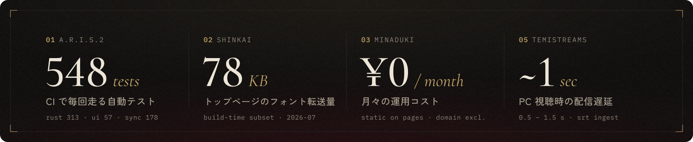
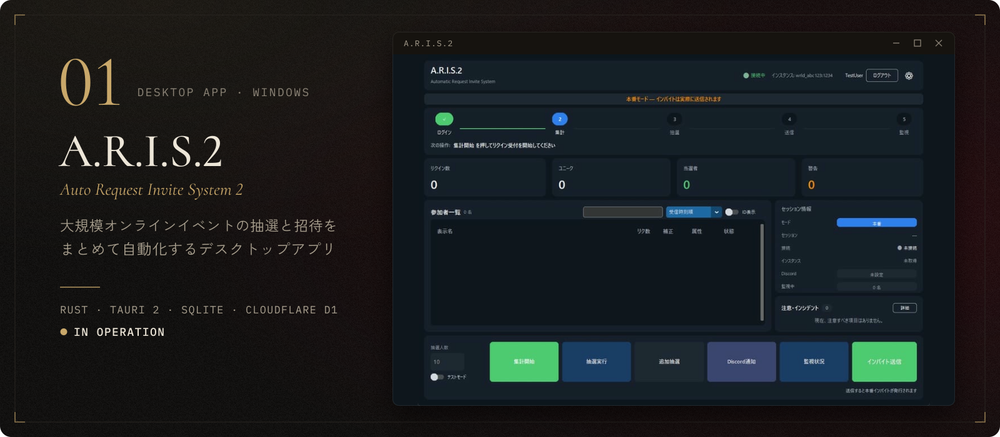
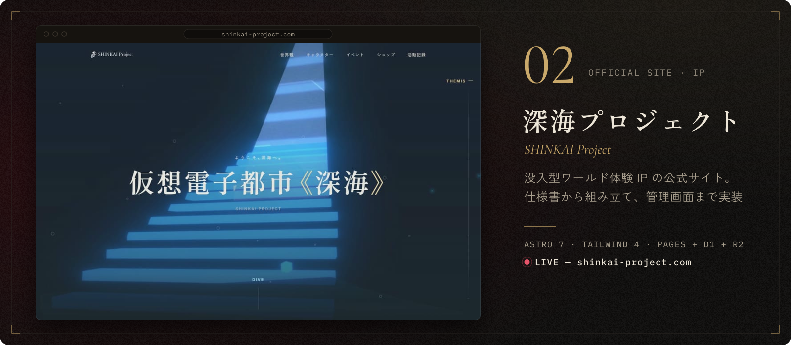
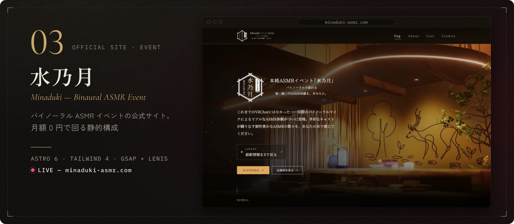
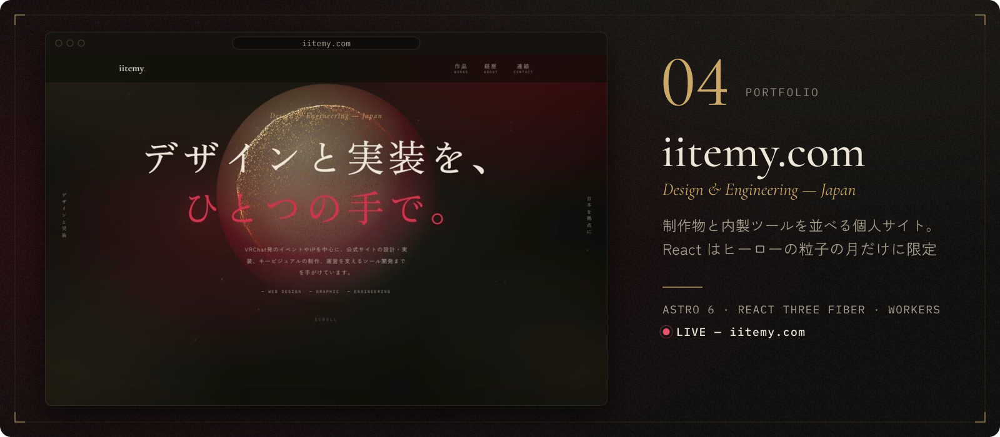
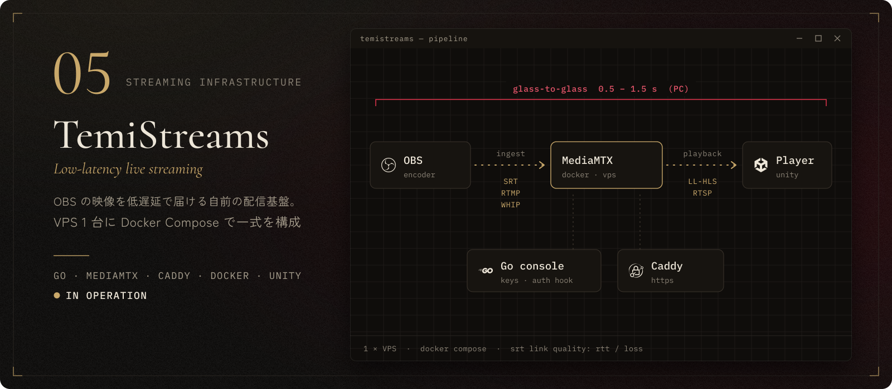
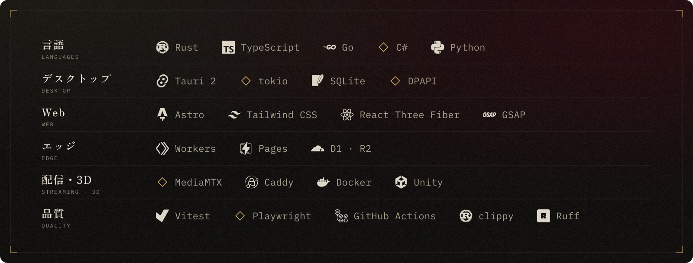

<picture>
  <source media="(prefers-color-scheme: light)" srcset="assets/hero-light.svg">
  
</picture>

オンラインイベントや IP を中心に、公式サイトの設計・実装、キービジュアルの制作、 
運営を支えるツール開発までを手がけています。

<a href="https://iitemy.com"><b>iitemy.com</b></a>&nbsp;&nbsp;·&nbsp;&nbsp;<a href="https://iitemy.com/contact">お仕事のご相談</a>

<picture>
  <source media="(prefers-color-scheme: light)" srcset="assets/stats-light.svg">
  
</picture>

## 作品

<picture>
  <source media="(prefers-color-scheme: light)" srcset="assets/work-aris2-light.svg">
  
</picture>

**A.R.I.S.2 — Auto Request Invite System 2** 
v4.3.2（2026-09）運用中　·　<a href="https://iitemy.com/works/aris2">制作事例 →</a>

大規模オンラインイベント向けの抽選・招待自動管理デスクトップアプリ（Windows 10/11）。参加申込の集計、参加履歴で重み付けした抽選、招待送信、入場管理を 1 つのアプリに集約しています。**v4.0 で Python 実装を Rust + Tauri 2 に全面移植**した、個人開発で最大規模のプロジェクトです。

- API と WebSocket を常時接続し、指数バックオフ再接続・HTTP フォールバック・429 リトライで集計を止めない
- 認証情報は Windows **DPAPI** でユーザー単位に暗号化し、パスワードは保存しない
- 複数インスタンス同時開催時の重複申込を同期バックエンド側で自動除外。過去開催は読み取り専用で閲覧できる

<b>構成とテスト</b>

 

| レイヤ | 構成 |
| --- | --- |
| デスクトップ本体 | Rust 1.95+ / tokio / reqwest / tokio-tungstenite / Tauri 2（6 crate 構成）/ SQLite (WAL) |
| フロントエンド | 依存ライブラリなしの HTML / CSS / JavaScript |
| 同期バックエンド | TypeScript / Cloudflare Workers + D1（複数インスタンス間の状態同期） |
| 配布 | GitHub Actions でリリースを自動化。非公開リポジトリでも動くアプリ内自動更新 |

- CI ゲート: `cargo fmt --check` / `cargo clippy -D warnings` / テスト Rust 313・フロント 57・同期バックエンド 178
- 旧 Python 実装（pytest 1,907 ケース）は `legacy/` に凍結し、Ruff + Pyright を CI で維持

 

<picture>
  <source media="(prefers-color-scheme: light)" srcset="assets/work-shinkai-light.svg">
  
</picture>

**深海プロジェクト 公式サイト** 
<a href="https://shinkai-project.com">shinkai-project.com</a>（2026-10-01 公開）　·　<a href="https://iitemy.com/works/shinkai-project-web">制作事例 →</a>

没入型のワールド体験 IP「深海プロジェクト」の公式サイト。**4 部構成の仕様書（第 2 部は 9 分冊）を先に書き、そこから実装する**進め方で構築しました。

- Astro 7 の完全静的出力。UI フレームワークは使わず、クライアント JS はインライン **4KB**・外部モジュール **8KB**（brotli）の予算を CI で強制
- **ビルド時フォントサブセット化**で、トップのフォント転送量 **78KB**・ページ全体 **109KB**（2026-07 計測）
- 公開直後のモバイル監査で `/characters/` の初回転送量を **1,960KB → 442KB** に削減（2026-10）
- 管理コンソールでキャラクター・イベント・世界観・作品・お知らせと各ページの文言を編集し、「公開」から GitHub Actions で再ビルド

<b>構成とテスト</b>

 

| レイヤ | 構成 |
| --- | --- |
| サイト | Astro 7（静的出力）/ Tailwind CSS 4 / TypeScript 5.9 / Node 22 |
| ホスティング | Cloudflare Pages。本番は毎日再ビルドして鮮度を確認 |
| 管理コンソール | Cloudflare Pages Functions + D1 + R2、編集内容をその場でプレビュー |

- Vitest 51 ファイルでコンテンツ整合性・フォント予算とグリフ網羅・リンクポリシー・管理用 SQL を検証（本番デプロイ時 1,379 テスト）
- Core Web Vitals はトップ **LCP 807ms / CLS 0.0044**（2026-07、仮素材での計測）

 

<picture>
  <source media="(prefers-color-scheme: light)" srcset="assets/work-minaduki-light.svg">
  
</picture>

**本格ASMRイベント『水乃月』公式サイト** 
<a href="https://minaduki-asmr.com">minaduki-asmr.com</a>　·　<a href="https://iitemy.com/works/minaduki-web">制作事例 →</a>

バイノーラル ASMR イベントの公式サイト。**月額・年額とも 0 円（ドメイン代を除く）での運用**を設計条件に置いた静的構成です。

- Astro 6 / Tailwind CSS 4 / TypeScript strict。出演者情報は Content Collections（Zod スキーマ）で型付き管理
- Cloudflare Pages に本番・ステージングの 2 環境。ステージングと `*.pages.dev` は `X-Robots-Tag: noindex`
- ダークモード単一のデザインシステムをトークンとして文書化し、GSAP + Lenis でモーションを設計
- フォントはセルフホスト、`@astrojs/sitemap` と自作 `BaseHead.astro` で SEO に対応

 

<picture>
  <source media="(prefers-color-scheme: light)" srcset="assets/work-iitemy-light.svg">
  
</picture>

**iitemy.com — 個人ポートフォリオ** 
<a href="https://iitemy.com">iitemy.com</a>　·　<a href="https://iitemy.com/works/edge-first-portfolio">制作事例 →</a>

Web 制作物・キービジュアル・ポスター・内製ツールを展示する個人サイト。

- Astro 6 + TypeScript strict / Tailwind CSS 4 / Cloudflare Workers（Static Assets）
- React 19 + React Three Fiber は、ヒーローで 32,000 粒子の月を描くアイランド 1 か所だけ。ほかはすべてサーバーレンダリング
- Vitest（ユニット 120 ケース）+ Playwright（e2e 14 本をデスクトップ Chrome / Pixel 7 の 2 環境で実行）
- ESLint flat config / Prettier / **release-please** によるリリース自動化、Pages CMS でコンテンツ編集

 

<picture>
  <source media="(prefers-color-scheme: light)" srcset="assets/work-temistreams-light.svg">
  
</picture>

**TemiStreams — 低遅延ライブ配信基盤** 
VPS 1 台で運用中

OBS から送った映像を、PC なら 0.5〜1.5 秒の遅延で視聴できる自前の配信基盤です。

- Docker Compose で一式を構成し、VPS の上り帯域と同時視聴者数から必要スペックを見積もり
- 取り込みはパケットロスに強い SRT を推奨。RTMP / WebRTC（WHIP）も同じキーで受け付ける
- 配信用トークンと視聴用パスを分離し、1 つのストリームキーを複数の配信者で共有できる

<b>構成</b>

 

| レイヤ | 構成 |
| --- | --- |
| 配信サーバー | MediaMTX（SRT / RTMP / WHIP で受信 → RTSP / LL-HLS で再配信。H264 / AAC の修正パッチ版） |
| 管理アプリ | Go / SQLite（ストリームキーの発行、認証フック、配信状態と SRT 回線品質の表示） |
| HTTPS | Caddy（管理画面 / HLS / WHIP） |
| クライアント | Unity（C#）製の同期再生プレイヤーと、シーンへ配置する Editor 拡張 |

いずれも非公開リポジトリで開発しています。

## 技術スタック

<picture>
  <source media="(prefers-color-scheme: light)" srcset="assets/stack-light.svg">
  
</picture>

## 開発で大事にしていること

**01　テストを CI ゲートにする** 
カバレッジだけでなく、性能予算・リンク切れ・フォントのグリフ網羅まで、壊れたら自動で落ちるようにする。

**02　性能を数値で管理する** 
「速い」ではなく LCP・CLS・転送量の実測値で判断し、計測日とともに記録する。

**03　固定費を小さく保つ** 
静的サイトは Cloudflare のエッジで継続課金なしに運用し、サーバーが要る配信基盤だけを VPS 1 台に収める。

**04　決定を文書に残す** 
仕様書・デザインシステム・技術選定の「採用理由と不採用理由」を `docs/` に残してから作る。

**05　AI エージェントと協働する** 
`CLAUDE.md` / `AGENTS.md` を同期させ、複数のコーディングエージェントが同じ規約で開発できるようにする。

## 連絡先

- Portfolio — [iitemy.com](https://iitemy.com)
- お仕事のご相談 — [iitemy.com/contact](https://iitemy.com/contact)

<a href="#top">↑ ページの先頭へ</a>

