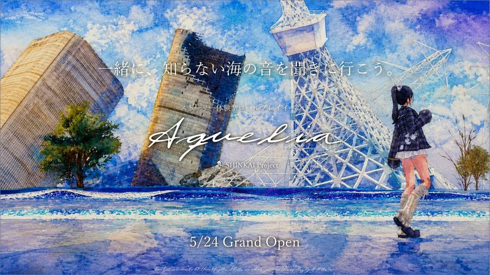
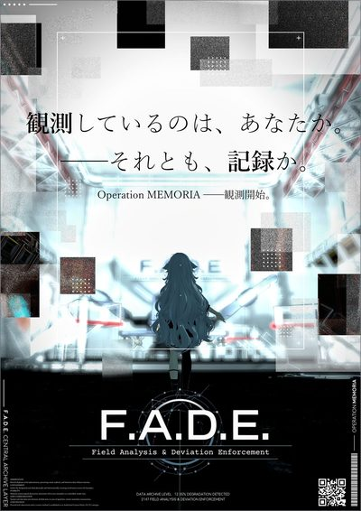
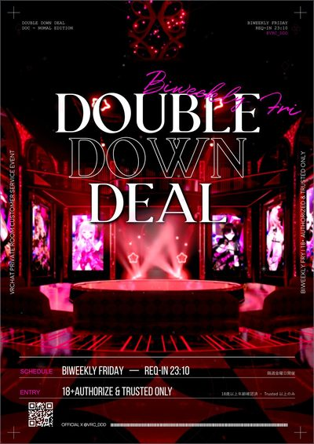
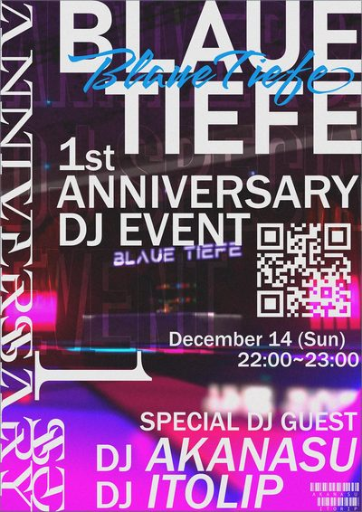
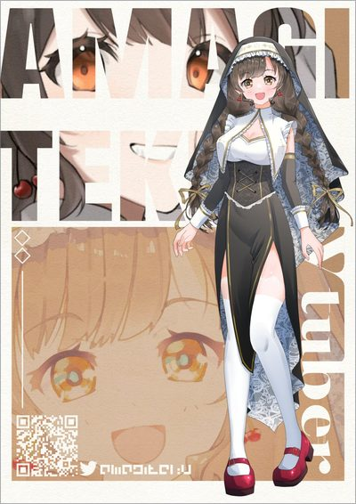
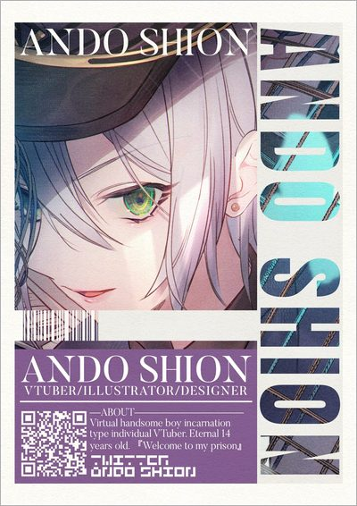

### デザインと実装を、ひとつの手で。

オンラインイベントや IP の公式サイト、キービジュアル、運営を支えるツールをつくっている tem です。

[iitemy.com](https://iitemy.com) · [お仕事のご相談](https://iitemy.com/contact)

#### Projects

  
  
  
  

- **[A.R.I.S.2](https://iitemy.com/works/aris2)** — 大規模オンラインイベントの抽選・招待を自動化する Windows アプリ 
  Rust · Tauri 2 · SQLite · Cloudflare Workers + D1 · v4.3.2
- **[深海プロジェクト 公式サイト](https://shinkai-project.com)** — 没入型ワールド体験 IP の公式サイトと管理コンソール。2026 年 10 月公開 
  Astro 7 · Tailwind CSS 4 · Cloudflare Pages + D1 + R2
- **[水乃月 公式サイト](https://minaduki-asmr.com)** — バイノーラル ASMR イベントの公式サイト。月額 0 円で運用する静的構成 
  Astro 6 · Tailwind CSS 4 · Cloudflare Pages
- **[iitemy.com](https://iitemy.com)** — ポートフォリオ。React はヒーローの 3D 表現 1 か所だけに限定 
  Astro 6 · React Three Fiber · Cloudflare Workers
- **TemiStreams** — OBS の映像を PC で 0.5〜1.5 秒の遅延で届ける自前の配信基盤 
  Go · MediaMTX · Caddy · Docker · Unity

いずれも非公開リポジトリで開発しています。

#### Graphics

  
  
  
  
  
  

キービジュアルとポスターの制作事例は <a href="https://iitemy.com">iitemy.com</a> に掲載しています。

#### Tech

Rust · TypeScript · Go · C# · Python 
Tauri · Astro · Tailwind CSS · React Three Fiber · Unity 
Cloudflare Workers / Pages / D1 / R2 · Docker · GitHub Actions

#### How I work

- テストと性能予算を CI で強制する（A.R.I.S.2 はテスト 548 件、深海は JS サイズ・フォント・リンクを検証）
- 静的サイトは Cloudflare のエッジで固定費をかけずに運用する
- 仕様と判断の理由を `docs/` に書いてから作る
