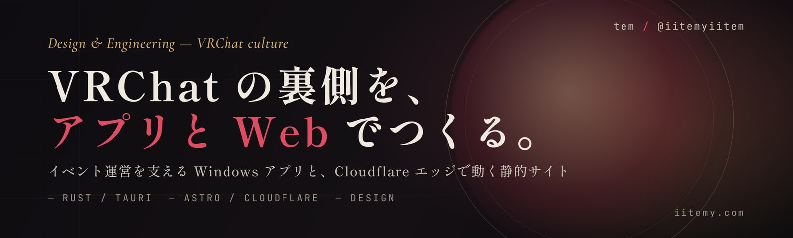
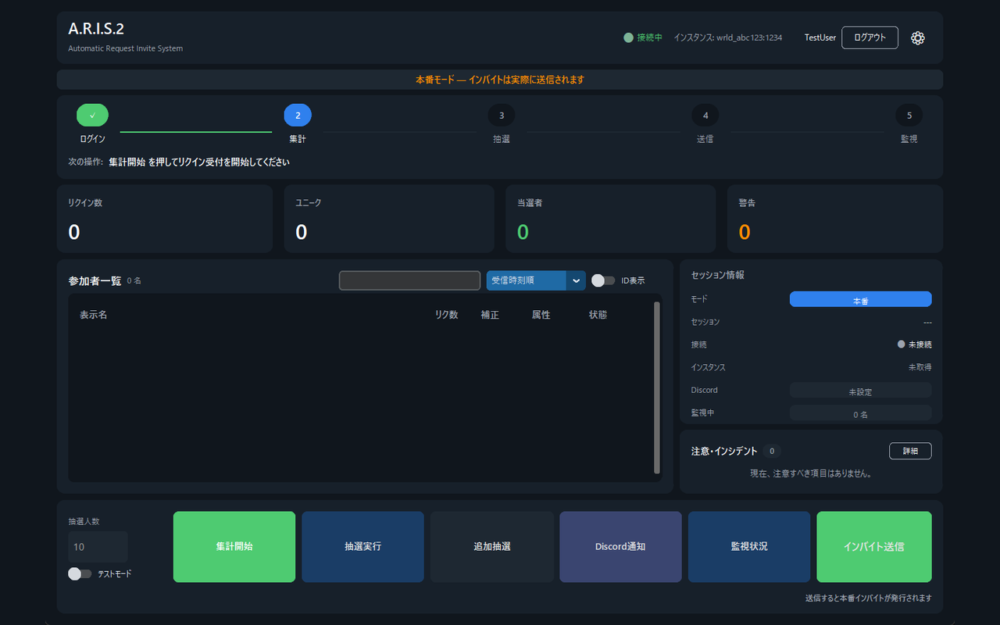
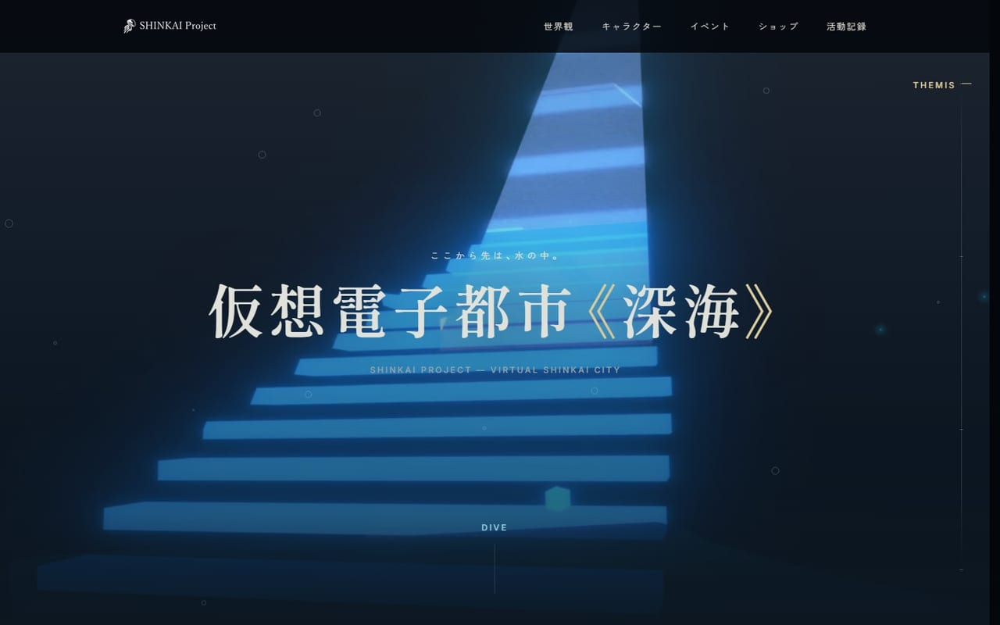
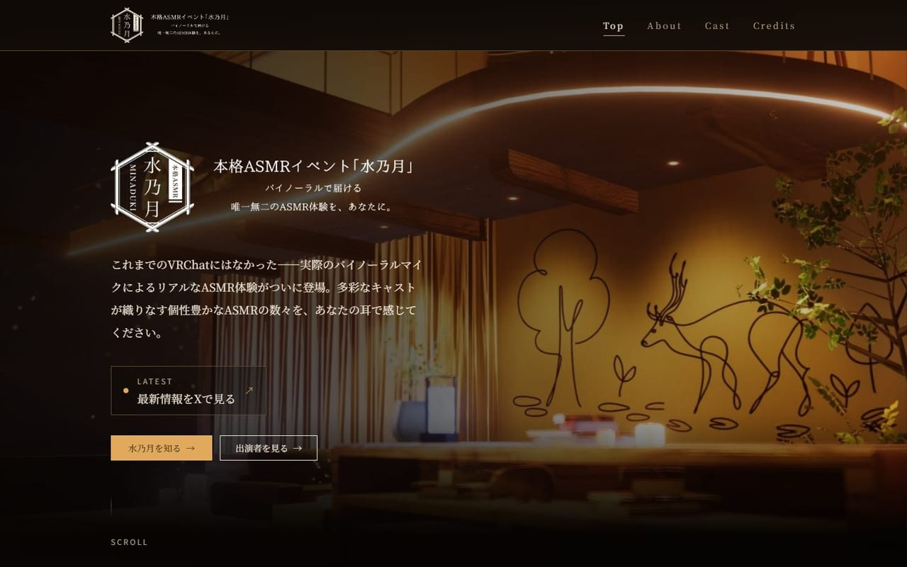
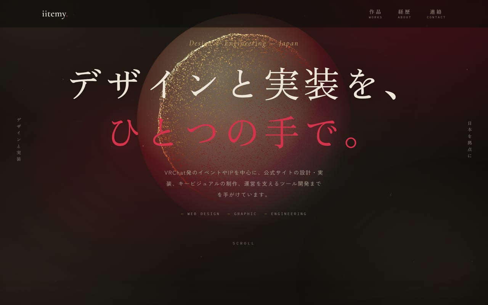

  

VRChat 発のイベントや IP を中心に、公式サイトの設計・実装、キービジュアルの制作、運営を支えるツール開発までを手がけています。
イベント運営を支える Windows アプリと、Cloudflare エッジで動く静的サイトが主戦場です。

---

## 📦 プロジェクト

<table>
  <tr>
    <td width="50%" valign="top">
       
      <b>A.R.I.S.2</b> 
      VRChat 大規模イベント向け 抽選・インバイト自動管理アプリ Rust · Tauri 2 · Cloudflare Workers + D1 · v4.3.0 運用中
    </td>
    <td width="50%" valign="top">
       
      <b>深海プロジェクト 公式サイト</b> 
      VRChat ワールド体験 IP の公式サイト Astro 7 · Tailwind CSS 4 · Cloudflare Pages · 公開準備中
    </td>
  </tr>
  <tr>
    <td width="50%" valign="top">
       
      <b>本格ASMRイベント『水乃月』公式サイト</b> 
      VRChat ASMR イベントの公式サイト Astro 6 · Tailwind CSS 4 · Cloudflare Pages · <a href="https://minaduki-asmr.com">公開中</a>
    </td>
    <td width="50%" valign="top">
       
      <b>portfolio — iitemy.com</b> 
      個人ポートフォリオサイト Astro 6 · Tailwind CSS 4 · Cloudflare Workers · <a href="https://iitemy.com">公開中</a>
    </td>
  </tr>
</table>

いずれも非公開リポジトリで開発しています。公開リポジトリは順次準備中です。

---

### A.R.I.S.2 — Auto Request Invite System 2

VRChat 大規模イベント向けの抽選・インバイト自動管理デスクトップアプリケーション（Windows 10/11）。
Request Invite の集計、参加履歴で重み付けした抽選、インバイト送信、入場管理を 1 つのアプリに集約しています。
**v4.0 で Python 実装を Rust + Tauri 2 に全面移植**し、個人開発では最大規模のプロジェクトです。

| レイヤ | 構成 |
| --- | --- |
| デスクトップ本体 | Rust 1.95+ / tokio / reqwest / tokio-tungstenite / Tauri 2（6 crate 構成）/ SQLite (WAL) |
| フロントエンド | 依存ライブラリなしの HTML / CSS / JavaScript |
| 同期バックエンド | TypeScript / Cloudflare Workers + D1（複数インスタンス間の状態同期） |
| 配布 | GitHub Actions によるリリース自動化、非公開リポジトリ対応のアプリ内自動更新 |

- VRChat API + WebSocket Pipeline を常時接続。指数バックオフ再接続・HTTP フォールバック・レート制限（429）リトライを実装
- 認証情報は Windows **DPAPI** でユーザー単位に暗号化し、パスワードは保存しない
- 複数インスタンス同時開催時の重複申込を同期側で自動除外、過去開催の読み取り専用ビューア
- CI ゲート: `cargo fmt --check` / `cargo clippy -D warnings` / Rust 305・フロント 56・同期バックエンド 176 のテスト
- 旧 Python 実装（pytest 1,907 ケース）は `legacy/` に凍結し、Ruff + Pyright を引き続き CI で維持

### 深海プロジェクト — [shinkai-project.com](https://shinkai-project.com)

VRChat 上のワールド体験 IP「深海プロジェクト」の公式サイト。
**9 部構成の仕様書を先に書き、そこから実装する**進め方で構築しています。本番ドメインは現在メンテナンス表示で、開発環境で公開準備を進めています。

- Astro 7（完全静的出力）/ Tailwind CSS 4 / TypeScript 5.9 / Node 22 / Cloudflare Pages
- UI フレームワーク不採用。クライアント JS はページあたり **4KB (brotli) 上限**のインラインスクリプトのみ許可
- **ビルド時フォントサブセット化**でトップページのフォント転送量 **78KB**、ページ全体 **109KB**（2026-07 時点の計測）
- Core Web Vitals は全ルートで予算内（トップ **LCP 807ms / CLS 0.0044**、同時点計測）
- Vitest 41 ファイルでコンテンツ整合性・フォント予算・リンクポリシーを検証し、CI ゲート化
- コンテンツ管理用の管理コンソールを Cloudflare Pages Functions + D1 + R2 で構築し、生成した Markdown をリポジトリにコミットする運用

### 本格ASMRイベント『水乃月』 — [minaduki-asmr.com](https://minaduki-asmr.com)

VRChat のバイノーラル ASMR イベントの公式サイト。**月額 $0 での運用**を制約条件に置いた構成です。

- Astro 6 / Tailwind CSS 4 / TypeScript strict / Node 22.12+
- Cloudflare Pages に本番・ステージングの 2 環境（ステージングと `*.pages.dev` は `X-Robots-Tag: noindex`）
- 出演者情報は Content Collections で型付き管理
- フォントはセルフホスト、`@astrojs/sitemap` と自作 `BaseHead.astro` で SEO 対応
- ダークモード単一のデザインシステムをトークンとして文書化、GSAP + Lenis によるモーション設計

### portfolio — [iitemy.com](https://iitemy.com)

Web 制作物・キービジュアル・ポスター・内製ツールを展示する個人サイト。

- Astro 6 + TypeScript strict / Tailwind CSS 4 / Cloudflare Workers（Static Assets）
- React 19 + React Three Fiber をヒーローのアイランド 1 箇所に限定。他はすべてサーバーレンダリング
- Vitest（ユニット 96 ケース）+ Playwright（e2e、デスクトップ + モバイル）の二層テスト
- ESLint flat config / Prettier / **release-please** によるリリース自動化、Pages CMS でコンテンツ編集

---

## 🛠 技術スタック

| 領域 | 技術 |
| --- | --- |
| 言語 |    |
| デスクトップ |   |
| Web |    |
| インフラ |   |
| 品質 |      |

---

## 🎯 開発で大事にしていること

- **テストを CI ゲートにする** — カバレッジだけでなく、パフォーマンス予算・リンク切れ・フォントのグリフ網羅まで自動で落とす
- **性能を数値で管理する** — 「速い」ではなく LCP・CLS・転送量の実測値で判断し、計測日とともに記録する
- **ゼロコスト運用** — Cloudflare のエッジ基盤を活かし、継続課金なしで本番を維持する
- **決定を文書に残す** — 設計書・デザインシステム・技術選定の「採用理由と不採用理由」を `docs/` に残す
- **AI エージェントとの協働** — `CLAUDE.md` / `AGENTS.md` を同期させ、複数のコーディングエージェントで一貫した規約のもと開発する

---

## 📫 Contact

- Portfolio: [iitemy.com](https://iitemy.com)
- GitHub: [@iitemyiitem](https://github.com/iitemyiitem)
